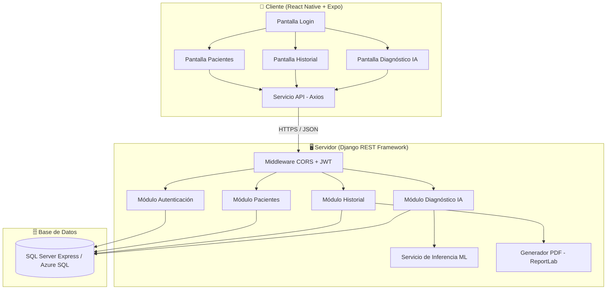
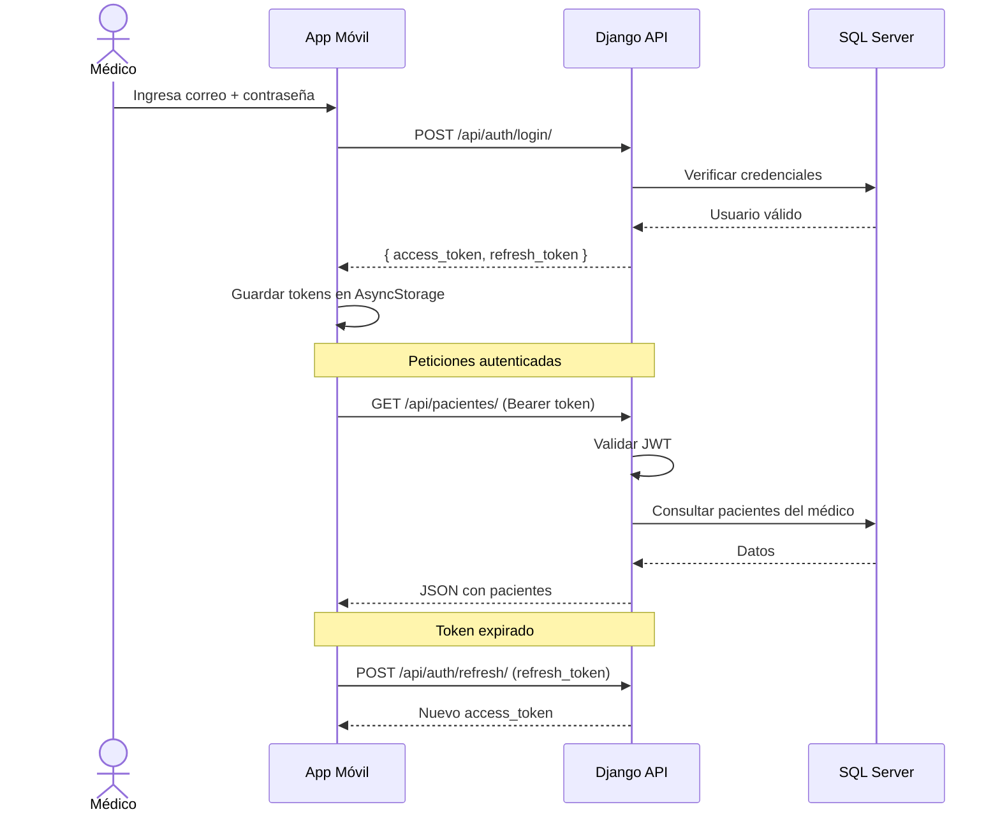
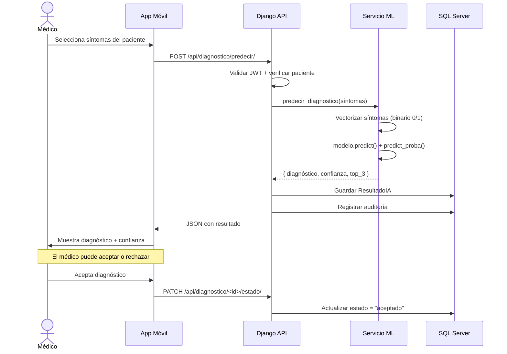

# 🏗️ Arquitectura del Sistema — ZAIRE Healthcare

## Visión General

ZAIRE Healthcare sigue una arquitectura **cliente-servidor REST** con separación clara entre frontend móvil y backend API. La comunicación se realiza mediante **HTTPS con JSON**, autenticada por tokens **JWT (Bearer)**.

---

## Diagrama de Arquitectura



---

## Capas del Sistema

### 1. Capa de Presentación (Frontend)
| Componente | Tecnología | Función |
|-----------|-----------|---------|
| App Móvil | React Native + Expo | Interfaz de usuario multiplataforma |
| Navegación | React Navigation | Flujo entre pantallas |
| HTTP Client | Axios | Comunicación con API REST |
| Estado | AsyncStorage | Almacenamiento de tokens JWT |

### 2. Capa de Negocio (Backend)
| Componente | Tecnología | Función |
|-----------|-----------|---------|
| API REST | Django REST Framework | Endpoints HTTP |
| Autenticación | Simple JWT | Tokens de acceso y refresco |
| CORS | django-cors-headers | Permitir peticiones del móvil |
| Filtros | django-filter | Búsqueda y filtrado de datos |
| PDF | ReportLab | Generación de historiales en PDF |
| IA | scikit-learn | Modelo de clasificación de diagnósticos |

### 3. Capa de Datos (Base de Datos)
| Componente | Tecnología | Función |
|-----------|-----------|---------|
| Desarrollo | SQL Server Express | BD local gratuita |
| Producción | Azure SQL Database | BD en la nube (crédito estudiante) |
| ORM | Django ORM + mssql-django | Abstracción de consultas SQL |

---

## Flujo de Autenticación JWT



---

## Flujo de Diagnóstico IA



---

## Módulos del Backend

```
backend/
├── config/                     ← Configuración central
│   ├── settings/
│   │   ├── base.py            ← Settings compartidos
│   │   ├── development.py     ← SQL Server Express local
│   │   └── production.py      ← Azure SQL + HTTPS
│   ├── urls.py                ← Rutas principales
│   └── wsgi.py / asgi.py
├── apps/
│   ├── autenticacion/         ← JWT, roles, auditoría
│   ├── pacientes/             ← CRUD pacientes
│   ├── historial/             ← Eventos clínicos + PDF
│   └── diagnostico/           ← Inferencia IA
│       └── ml/
│           ├── servicio_ia.py ← Carga modelo y predice
│           └── modelos_guardados/  ← Archivos .joblib
└── utils/                     ← Utilidades compartidas
```

---

## Decisiones de Diseño

| Decisión | Justificación |
|---------|---------------|
| **Monorepo** | Backend y frontend en un solo repositorio para facilitar CI/CD y revisiones |
| **Settings separados** | Evita exponer configuración de producción en desarrollo |
| **Usuario por correo** | Más práctico que username en contexto hospitalario |
| **JWT con blacklist** | Logout real invalidando el refresh token |
| **IA como servicio integrado** | Sin microservicio adicional para el MVP, se carga en memoria |
| **PDF con ReportLab** | Generación server-side sin dependencias externas |
| **JSON para síntomas** | Flexibilidad para almacenar listas variables de síntomas |

---

## Requerimientos No Funcionales Cubiertos

| RNF | Descripción | Cómo se cumple |
|-----|-------------|----------------|
| RNF-01 | Respuesta <3 seg | Django optimizado + select_related |
| RNF-02 | Disponibilidad 99.5% | AWS App Runner con auto-scaling |
| RNF-03 | HTTPS obligatorio | SECURE_SSL_REDIRECT en producción |
| RNF-04 | Compatibilidad móvil | React Native multiplataforma |
| RNF-05 | Datos cifrados | JWT + HTTPS + SQL Server TDE |
| RNF-06 | Interfaz intuitiva | Diseño Mobile-First con paleta ZAIRE |
| RNF-08 | Registro de actividades | Modelo RegistroAcceso (RF-12) |
