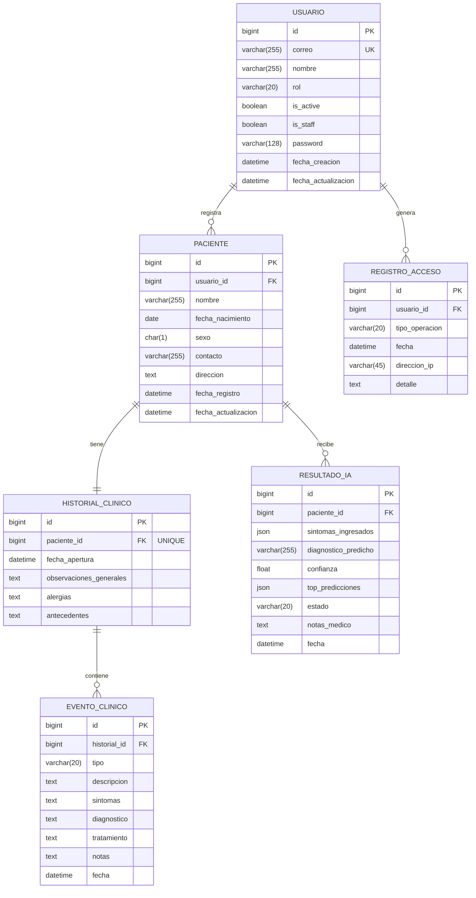

# 🗄️ Base de Datos — ZAIRE Healthcare

## Estrategia: SQL Server Express (Local) → Azure SQL Database (Producción)

| Fase | Motor | Costo | Cuándo |
|------|-------|-------|--------|
| **Desarrollo** | SQL Server Express 2022 | $0 | Durante todo el desarrollo |
| **Producción** | Azure SQL Database | $0 (crédito estudiante) | Al desplegar |

> **Nota**: La migración de local a Azure es muy sencilla. Solo se cambia el host en las variables de entorno. Django se encarga del resto.

---

## Instalación de SQL Server Express (Windows)

### Paso 1: Descargar SQL Server Express 2022

1. Ir a: https://www.microsoft.com/es-mx/sql-server/sql-server-downloads
2. Scroll hasta **"Express"** → Descargar gratis
3. Seleccionar **"Básica"** durante la instalación
4. Esperar a que se complete (~5-10 min)

### Paso 2: Instalar SQL Server Management Studio (SSMS)

1. Ir a: https://learn.microsoft.com/es-mx/sql-server/ssms/download-sql-server-management-studio-ssms
2. Descargar e instalar la versión más reciente
3. Esto permite administrar la BD con interfaz gráfica

### Paso 3: Configurar la Autenticación Mixta

Por defecto SQL Server solo permite autenticación de Windows. Necesitamos habilitar **autenticación mixta** (Windows + SQL Server) para que Django pueda conectarse:

1. Abrir **SSMS** → Conectar al servidor local
2. Click derecho en el servidor → **Propiedades**
3. Ir a **Seguridad** → Seleccionar **"Modo de autenticación de SQL Server y Windows"**
4. Click en **Aceptar**
5. **Reiniciar el servicio SQL Server**:
   - Abrir Servicios de Windows (`services.msc`)
   - Buscar `SQL Server (SQLEXPRESS)` → Reiniciar

### Paso 4: Configurar el Usuario `sa`

1. En SSMS, expandir **Seguridad** → **Inicios de sesión**
2. Click derecho en `sa` → **Propiedades**
3. En **General**: Establecer una contraseña segura
4. En **Estado**: Cambiar "Inicio de sesión" a **Habilitado**
5. Click en **Aceptar**

### Paso 5: Habilitar TCP/IP

Django se conecta por TCP/IP, que está deshabilitado por defecto:

1. Abrir **SQL Server Configuration Manager**
   - Buscar en Inicio: "SQL Server Configuration Manager"
   - Si no aparece, buscar: `SQLServerManager16.msc` en `C:\Windows\SysWOW64\`
2. Ir a **Configuración de red de SQL Server** → **Protocolos de SQLEXPRESS**
3. Click derecho en **TCP/IP** → **Habilitar**
4. Click derecho en **TCP/IP** → **Propiedades**
5. En la pestaña **Direcciones IP**:
   - Scroll hasta **IPAll**
   - Establecer **Puerto TCP** = `1433`
   - Borrar cualquier valor de **Puerto dinámico TCP**
6. **Reiniciar el servicio SQL Server**

### Paso 6: Instalar el Driver ODBC

Django necesita el driver ODBC para conectarse:

1. Ir a: https://learn.microsoft.com/es-mx/sql/connect/odbc/download-odbc-driver-for-sql-server
2. Descargar **ODBC Driver 17 for SQL Server** (Windows)
3. Instalar con las opciones por defecto

### Paso 7: Crear la Base de Datos

En SSMS, ejecutar:
```sql
CREATE DATABASE zaire_healthcare;
GO
```

O desde la terminal:
```bash
sqlcmd -S localhost -U sa -P tu_contraseña -Q "CREATE DATABASE zaire_healthcare"
```

### Paso 8: Configurar Variables de Entorno

Copiar el archivo `.env.example` a `.env` en `backend/`:
```bash
copy backend\.env.example backend\.env
```

Editar `backend/.env` con tus datos:
```env
DB_NAME=zaire_healthcare
DB_USER=sa
DB_PASSWORD=tu_contraseña_de_sa
DB_HOST=localhost
DB_PORT=1433
```

### Paso 9: Ejecutar Migraciones

```bash
cd backend
venv\Scripts\activate
python manage.py makemigrations
python manage.py migrate
python manage.py createsuperuser
```

### Paso 10: Verificar Conexión

```bash
python manage.py runserver 0.0.0.0:8000
```

Si ves `Starting development server at http://0.0.0.0:8000/` sin errores ✅

---

## Modelo Entidad-Relación



---

## Tablas y Relaciones

| Tabla | Descripción | Relación |
|-------|------------|----------|
| `usuario` | Usuarios del sistema (médicos, enfermeros, admin) | — |
| `paciente` | Pacientes registrados | Pertenece a un `usuario` |
| `historial_clinico` | Historial médico del paciente (uno por paciente) | 1:1 con `paciente` |
| `evento_clinico` | Consultas, diagnósticos, tratamientos | Pertenece a un `historial` |
| `resultado_ia` | Resultados de diagnóstico IA | Pertenece a un `paciente` |
| `registro_acceso` | Log de operaciones del sistema | Pertenece a un `usuario` |

---

## Migración a Azure SQL Database

Cuando estés listo para desplegar, sigue estos pasos:

### 1. Crear Azure SQL Database
1. Ir a https://portal.azure.com (con cuenta de estudiante)
2. **Crear recurso** → **SQL Database**
3. Configurar:
   - Nombre del servidor: `zaire-server`
   - Nombre de la BD: `zaire_healthcare`
   - Ubicación: `South Central US` (más cercana a México)
   - Plan: **Básico** ($5/mes, cubierto por crédito)
4. En **Firewalls**: Agregar tu IP actual

### 2. Cambiar Variables de Entorno
Solo editar `backend/.env`:
```env
DB_HOST=zaire-server.database.windows.net
DB_USER=tu_usuario_azure
DB_PASSWORD=tu_contraseña_azure
DB_NAME=zaire_healthcare
```

### 3. Ejecutar Migraciones en Azure
```bash
python manage.py migrate
python manage.py createsuperuser
```

> **¡Eso es todo!** El ORM de Django genera las mismas tablas en Azure que las que tenías en local. No necesitas cambiar ni una línea de código.

---

## Solución de Problemas Comunes

| Error | Causa | Solución |
|-------|-------|---------|
| `pyodbc.OperationalError: Login failed` | Contraseña incorrecta o `sa` deshabilitado | Verificar paso 4 |
| `pyodbc.OperationalError: TCP/IP connection failed` | TCP/IP no habilitado | Verificar paso 5 |
| `No suitable ODBC driver found` | Driver ODBC no instalado | Verificar paso 6 |
| `Cannot open database` | BD no creada | Verificar paso 7 |
| `Login timeout expired` | Puerto 1433 bloqueado por firewall | Agregar excepción en Windows Firewall |
