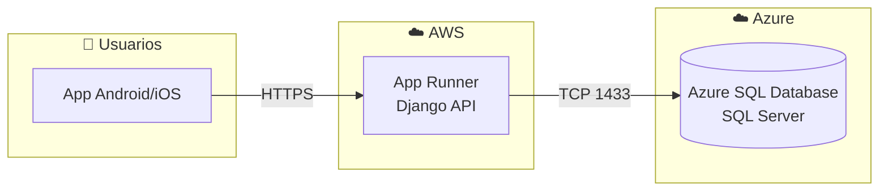

# 🚀 Plan de Despliegue — ZAIRE Healthcare

## Arquitectura de Despliegue



| Componente | Servicio | Costo |
|-----------|---------|-------|
| Backend (Django) | AWS App Runner | ~$2-5 USD/mes |
| Base de Datos | Azure SQL Database | $0 (crédito estudiante) |
| APK Android | Expo EAS Build | $0 (plan gratuito) |

---

## Fase 1: Desarrollo Local

### Backend
```bash
cd backend
venv\Scripts\activate
python manage.py runserver 0.0.0.0:8000
```

### Frontend (Expo Go)
```bash
cd frontend
npx expo start
```

> Escanear QR con Expo Go → conecta al backend en la IP local.

### Conexión Móvil ↔ Backend Local
1. Asegurarse de que el celular y la PC estén en la **misma red WiFi**
2. En Expo, la API URL será: `http://<IP-de-tu-PC>:8000/api/`
3. Encontrar tu IP: `ipconfig` → Adaptador WiFi → IPv4

---

## Fase 2: Despliegue del Backend en AWS

### 2.1 Prerrequisitos
- Cuenta AWS con créditos de estudiante (AWS Educate)
- Docker instalado localmente
- AWS CLI configurado

### 2.2 Crear Dockerfile

Archivo `backend/Dockerfile`:
```dockerfile
FROM python:3.12-slim

# Instalar dependencias del sistema para pyodbc
RUN apt-get update && apt-get install -y \
    unixodbc-dev \
    gcc \
    curl \
    gnupg2 \
    && curl https://packages.microsoft.com/keys/microsoft.asc | apt-key add - \
    && curl https://packages.microsoft.com/config/debian/12/prod.list > /etc/apt/sources.list.d/mssql-release.list \
    && apt-get update \
    && ACCEPT_EULA=Y apt-get install -y msodbcsql17 \
    && rm -rf /var/lib/apt/lists/*

WORKDIR /app

COPY requirements.txt .
RUN pip install --no-cache-dir -r requirements.txt

COPY . .

RUN python manage.py collectstatic --noinput

EXPOSE 8000

CMD ["gunicorn", "config.wsgi:application", "--bind", "0.0.0.0:8000", "--workers", "2"]
```

### 2.3 Desplegar en AWS App Runner

1. **Crear repositorio ECR**:
   ```bash
   aws ecr create-repository --repository-name zaire-backend
   ```

2. **Build y push de imagen Docker**:
   ```bash
   docker build -t zaire-backend backend/
   docker tag zaire-backend:latest <account-id>.dkr.ecr.<region>.amazonaws.com/zaire-backend:latest
   aws ecr get-login-password | docker login --username AWS --password-stdin <account-id>.dkr.ecr.<region>.amazonaws.com
   docker push <account-id>.dkr.ecr.<region>.amazonaws.com/zaire-backend:latest
   ```

3. **Crear servicio App Runner**:
   - Ir a la consola de AWS → App Runner → Create Service
   - Source: ECR image
   - CPU: 0.25 vCPU
   - Memory: 0.5 GB
   - Variables de entorno: Configurar las de producción (ver VARIABLES-ENTORNO.md)
   - Port: 8000

### 2.4 Configurar Dominio Personalizado (Opcional)
- En App Runner → Custom domains → Agregar dominio
- Configurar registros DNS (CNAME)

---

## Fase 3: Base de Datos en Azure

### 3.1 Crear Azure SQL Database
1. Portal de Azure → **Crear recurso** → **SQL Database**
2. Configurar:
   - **Grupo de recursos**: `zaire-rg`
   - **Nombre del servidor**: `zaire-db-server`
   - **Nombre de BD**: `zaire_healthcare`
   - **Ubicación**: `South Central US`
   - **Compute + storage**: Básico (~$5/mes, cubierto por crédito)
3. **Firewall**: Agregar IP de AWS App Runner

### 3.2 Actualizar Variables de Entorno
En AWS App Runner, cambiar:
```env
DB_HOST=zaire-db-server.database.windows.net
DB_USER=admin_zaire
DB_PASSWORD=<contraseña_segura>
DB_NAME=zaire_healthcare
```

### 3.3 Ejecutar Migraciones
```bash
# Desde local, apuntando a Azure
DJANGO_SETTINGS_MODULE=config.settings.production python manage.py migrate
```

---

## Fase 4: Generar APK con Expo EAS

### 4.1 Configurar EAS
```bash
cd frontend
npx eas-cli login
npx eas-cli build:configure
```

### 4.2 Actualizar la URL de la API
En `frontend/src/services/api.js`, cambiar la URL base:
```javascript
const API_URL = 'https://tu-servicio.awsapprunner.com/api/';
```

### 4.3 Build del APK (Android)
```bash
npx eas-cli build --platform android --profile preview
```

- El build tarda ~15 min
- Expo genera un link para descargar el `.apk`
- Instalar directamente en el celular

### 4.4 Build del AAB (Google Play)
```bash
npx eas-cli build --platform android --profile production
```

---

## Checklist de Despliegue

- [ ] SQL Server Express configurado localmente (desarrollo)
- [ ] Backend funciona en localhost:8000
- [ ] Frontend se conecta al backend desde Expo Go
- [ ] Azure SQL Database creado
- [ ] Variables de entorno de producción configuradas
- [ ] Dockerfile listo y probado
- [ ] Imagen Docker en AWS ECR
- [ ] App Runner desplegado
- [ ] Migraciones ejecutadas en Azure
- [ ] APK generado con EAS Build
- [ ] Pruebas en dispositivo real
